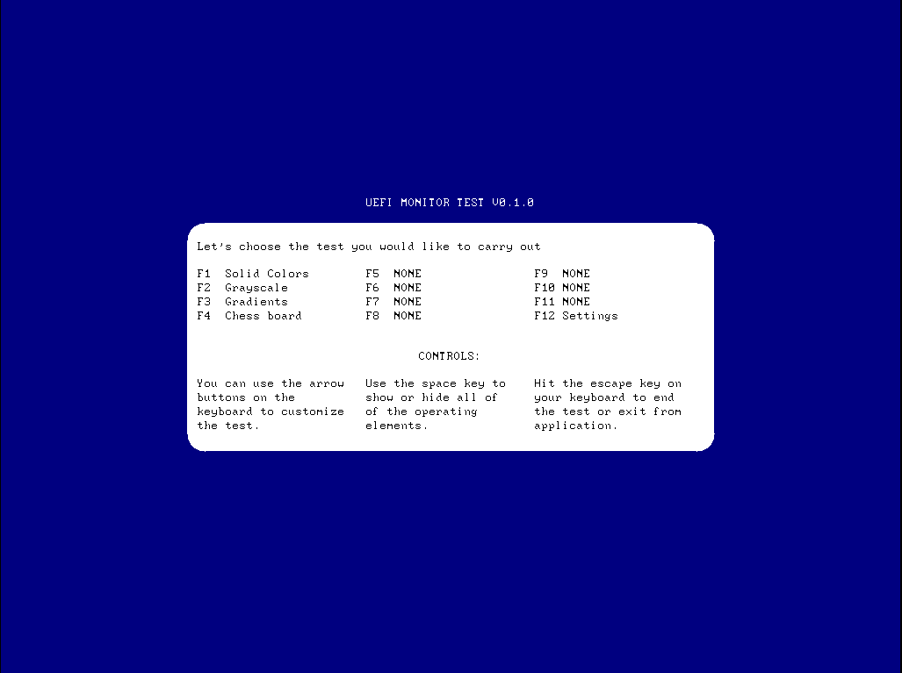
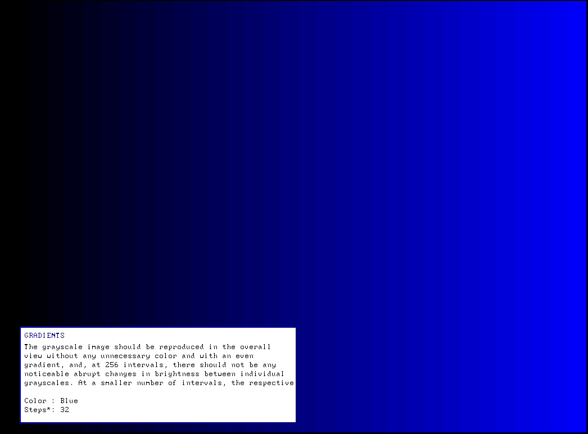

# UEFI Monitor Test

A monitor diagnostic and testing tool. It includes several tests that should allow you to diagnose any potential problems with your monitor. The application is based on the [TianoCore EDK II](https://www.tianocore.org/) development environment. Distributed under the BSD-2-Clause Plus Patent License.

## Tests

* Solid colors
* Grayscale
* Gradients
* Chess board 

## Compilation

1. Move `UefiMonitorTest` directory to a desired EDK II *Package*

2. Add the following line to *Package*.dsc, section "Components":

```
[Components]
  ...
  Package/UefiMonitorTest/UefiMonitorTest.inf
  ..
```

That's all. You can compile the application.

## Binary release

Compiling programs for UEFI is not always convenient, especially for an application. Therefore, precompiled application is distributed. You can find binaries (for x86_64) at [joursoir.net/storage/binaries/umt](http://joursoir.net/storage/binaries/umt/).

## Usage

Move the generated `UefiMonitorTest.efi` to some file system and run it via Uefi Shell:

```
Shell> UefiMonitorTest.efi
```

The app doesn't currently support command line arguments.

### Controls

You can only use your keyboard to navigate through the application.

```
- UP ARROW / DOWN ARROW: change the parameter
- LEFT ARROW / RIGHT ARROW: change the value of the parameter
- SPACE: show or hide all additional information
- F1-F11: choose the test
- F12: open the monitor settings menu
- ESC: end the test or exit from the application
```

## Screenshots




